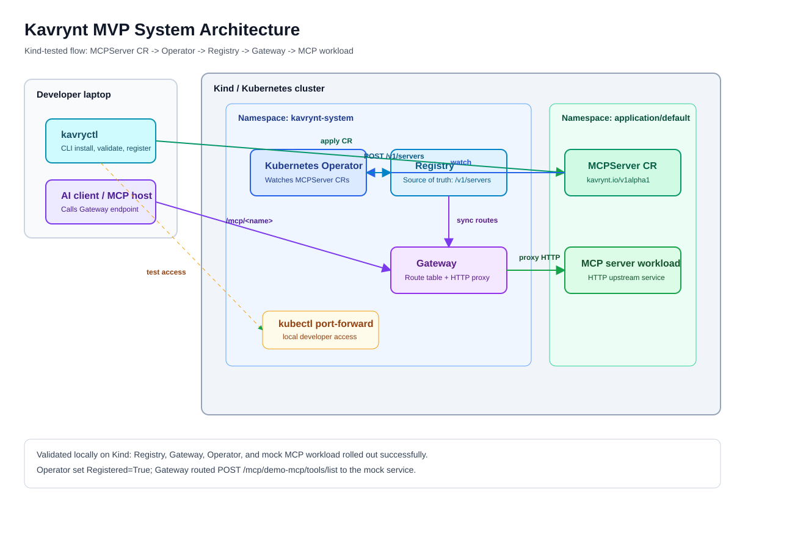

# HLD-0002: Kavrynt MVP System Architecture

## Summary

This HLD defines a concrete draft architecture for the four Kavrynt MVP
components:

- `kavryctl`
- Gateway
- Kubernetes Operator
- Registry

The design solves a real MCP-world problem: teams can build MCP servers, but
they need a production operating model for registration, deployment, access,
policy, observability, versioning, and rollback.

## Real-World Scenario

A platform team wants to expose internal tools to AI applications through MCP:

- source-code search,
- incident lookup,
- deployment status,
- ticket creation,
- database metadata,
- internal documentation search.

Without Kavrynt, every team deploys MCP servers differently. Security teams do
not know which tools exist, operators do not have a standard lifecycle model,
and developers cannot reliably upgrade or roll back MCP server versions.

Kavrynt provides the infrastructure layer:

```text
MCP server definition
  -> register
  -> deploy
  -> expose through controlled Gateway
  -> observe
  -> version
  -> upgrade / rollback
```

## Important MCP Assumption

MCP has hosts, clients, and servers. A host creates a client connection to each
server. Servers expose tools, resources, and prompts. MCP supports stdio for
local process communication and streamable HTTP for remote communication.

Kavrynt is not an MCP host in this MVP. Kavrynt is infrastructure around MCP
servers.

## System Architecture



Editable source: [HLD-0002-System-Architecture.drawio](../../diagrams/source/HLD-0002-System-Architecture.drawio)

The current Kind-tested MVP has two supported control paths:

- `kavryctl` can register MCP server manifests directly with Registry.
- The Kubernetes Operator can watch `MCPServer` custom resources and sync those
  records into Registry.

Gateway consumes Registry as the route source of truth and proxies HTTP MCP
traffic to the registered upstream endpoint. In this MVP, the Operator does not
deploy MCP server workloads yet; it syncs Kubernetes intent into Registry.

## Public Alpha Delivery Architecture

Kavrynt should be usable by a developer without cloning every component
repository separately. The public alpha delivery model is:

```text
GitHub Releases
  -> kavryctl binaries and checksums

Docker Hub
  -> kavrynt/registry
  -> kavrynt/gateway
  -> kavrynt/k8s-operator

Helm
  -> charts/kavrynt source chart today
  -> oci://ghcr.io/kavrynt/charts/kavrynt after tagged release
```

Developer install flow:

```text
curl -fsSL https://kavrynt.com/install.sh | sh
  -> installs kavryctl

helm upgrade --install kavrynt charts/kavrynt
  -> creates kavrynt-system namespace
  -> runs Registry, Gateway, and Operator
```

The source checkout is still required for the Helm chart until the first tagged
chart release is published. After that, developers should be able to install the
control plane directly from the OCI Helm chart.

## Control Plane

Control-plane responsibilities:

- store desired MCP server metadata,
- validate server definitions,
- manage versions,
- reconcile Kubernetes runtime state,
- configure Gateway routes,
- expose operational status.

Control-plane components:

- `kavryctl`
- Registry
- Kubernetes Operator
- Kubernetes API, where Kubernetes deployment is used.

## Data Plane

Data-plane responsibilities:

- receive MCP client traffic,
- route to approved MCP server workloads,
- enforce configured access decisions when policy is implemented,
- emit request and failure telemetry.

Data-plane component:

- Gateway

## Component Responsibilities

| Component | Primary Role | Owns | Does Not Own |
| --- | --- | --- | --- |
| `kavryctl` | CLI for developer/operator workflows | user commands, local validation, status presentation | long-running state, traffic proxying |
| Registry | Source of truth for MCP server metadata and versions | server records, versions, lifecycle metadata, policy references | Kubernetes reconciliation, runtime traffic |
| Operator | Kubernetes reconciliation loop | `MCPServer` CR watch, Registry upsert/delete, finalizer cleanup, status conditions | MCP workload deployment in this MVP, product metadata source of truth |
| Gateway | MCP data-plane access point | Registry sync, route table, HTTP proxying, request telemetry | source-of-truth registry, workload deployment |

## Primary Workflow

### 1. Register

```text
Developer writes mcp-server.yaml
  -> kavryctl validate
  -> kavryctl register
  -> Registry stores MCP server metadata and version
```

### 2. Kubernetes-native registration

```text
kubectl apply -f mcpserver.yaml
  -> Kubernetes API stores MCPServer
  -> Operator watches MCPServer
  -> Operator upserts Registry record
  -> Operator writes Registered=True status
```

### 3. Use

```text
MCP Host
  -> MCP Client
  -> Gateway /mcp/<server-name>
  -> Gateway route lookup
  -> registered MCP Server HTTP endpoint
```

### 4. Observe

```text
kavryctl status <server>
  -> Registry status
  -> Kubernetes status
  -> Gateway route health
```

### 5. Upgrade / Rollback

```text
kavryctl register new version
  -> Registry updates server record
  -> Gateway syncs updated route table
  -> future production release adds rollout/rollback semantics
```

## Deployment Topology

MVP topology in Kubernetes:

```text
Namespace: kavrynt-system
  - Registry API service
  - Gateway service
  - Operator deployment

Namespace: team/application namespace
  - MCP server workloads
  - Services for MCP workloads
  - MCPServer custom resources
```

Local developer topology:

```text
Developer laptop
  -> Docker Desktop
  -> Kind cluster
  -> kubectl port-forward to Gateway and Registry
```

Distribution topology:

```text
Developer laptop
  -> kavryctl
  -> kubectl / Helm
  -> Kind or any Kubernetes cluster
  -> kavrynt-system namespace
```

## Local MVP Validation Evidence

The MVP flow was validated on a local Kind cluster:

```text
MCPServer CR
  -> k8s-operator
  -> Registry
  -> Gateway route table
  -> mock MCP service
```

Confirmed behavior:

- Registry, Gateway, Operator, and mock MCP workload rolled out successfully.
- `MCPServer/demo-mcp` reached `Registered=True`.
- Registry returned the synced `demo-mcp` server record.
- Gateway returned one route for `demo-mcp`.
- Gateway proxied `POST /mcp/demo-mcp/tools/list` to the mock MCP service.
- Deleting the `MCPServer` removed the Registry record and Gateway route after
  the next sync interval.

Current implementation status:

- Public monorepo exists at `kavrynt/kavrynt`.
- CI runs Go tests, `go vet`, Docker builds, vulnerability scanning, Helm lint,
  and Helm template rendering.
- Release automation exists for `kavryctl` binaries and the umbrella Helm chart.
- Runtime images are published on Docker Hub under the `kavrynt` organization.
- The next release hardening work is versioned image publishing, multi-arch
  images, pinned image digests, OCI labels, and signed/attested artifacts.

## State Model

Registry source-of-truth state:

- server id,
- name,
- description,
- labels,
- owner/team,
- transport type,
- endpoint or runtime target,
- versions,
- desired lifecycle state,
- policy references,
- last observed status,
- audit metadata.

Operator observed state:

- workload ready,
- service ready,
- route configured,
- selected version,
- error conditions.

Gateway runtime state:

- route table,
- upstream health,
- request counts,
- error counts,
- future auth/policy decisions.

## Security Boundaries

Initial boundaries:

- `kavryctl` runs with user credentials.
- Registry authenticates control-plane writes in future remote mode.
- Operator uses Kubernetes RBAC with least privilege.
- Gateway is the external/runtime access boundary for remote MCP traffic.
- MCP server workloads run with isolated service accounts.

MVP security decisions still required:

- authentication model,
- authorization model,
- policy binding model,
- audit event schema,
- secret storage,
- Gateway TLS and identity model,
- release signing and artifact provenance model.

## Observability

Each component should expose:

- structured logs,
- health/readiness semantics where long-running,
- metrics,
- error conditions,
- version/build metadata.

MVP minimum:

- `kavryctl status`,
- Registry health endpoint,
- Operator reconciliation metrics,
- Gateway request/error metrics,
- Kubernetes events for reconciliation failures.

## Failure Handling

Important failures:

- invalid manifest,
- Registry unavailable,
- Operator cannot reconcile,
- Gateway route missing,
- MCP server unhealthy,
- rollout fails,
- rollback requested.

The MVP should make these failures visible through `kavryctl status` and
component logs before adding advanced automation.

## Why This Architecture

This architecture separates concerns:

- developers get a clear CLI,
- platform teams get a source of truth,
- Kubernetes runtime logic stays in the Operator,
- MCP traffic stays in the Gateway,
- future security and policy have clear enforcement points.

## Open Questions

- Should Registry be required before Kubernetes deployment, or can CRDs be the
  source of truth in Kubernetes-only mode?
- Does Gateway terminate and understand MCP messages, or initially route HTTP
  traffic transparently?
- Which MCP capability metadata should Registry store?
- What is the first authentication and authorization model?
- What is the first policy language?
- What is the first audit event schema?
