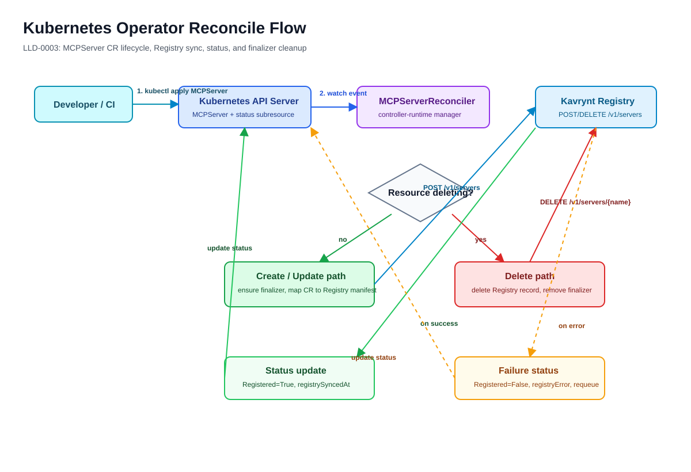

# LLD-0003: Kubernetes Operator Low-Level Design

## Summary

The Operator is a Kubernetes controller that reconciles `MCPServer` custom
resources into Kavrynt Registry records.

In the current MVP, the Operator does not create MCP server Deployments,
Services, or Gateway route objects. It gives Kubernetes users a native control
path for declaring MCP server metadata, while Registry remains the route source
of truth consumed by Gateway.

## Reconcile Diagram



Editable source: [LLD-0003-Operator-Reconcile.drawio](../../diagrams/source/LLD-0003-Operator-Reconcile.drawio)

## Runtime Modules

```text
operator/
  main.go
  api/v1alpha1
  internal/controller
  internal/registry
  internal/build
  charts/k8s-operator
  config/crd
  config/rbac
  config/manager
```

## CRD: MCPServer

Implemented spec:

- `spec.version`
- `spec.transport`
- `spec.endpoint` for HTTP MCP servers
- `spec.command` and `spec.args` for future stdio support
- `spec.environment`

Implemented status:

- observed generation,
- conditions,
- `registrySyncedAt`,
- `registryError`.

Primary condition:

- `Registered`

## Reconciliation Flow

```text
watch MCPServer
  -> add registry-sync finalizer
  -> map MCPServer spec to Registry manifest
  -> POST /v1/servers
  -> update status Registered=True
```

Delete flow:

```text
MCPServer deletionTimestamp set
  -> Operator sees finalizer
  -> DELETE /v1/servers/{name}
  -> remove finalizer
  -> Kubernetes deletes MCPServer
```

Failure flow:

```text
Registry unavailable or rejects request
  -> update status Registered=False
  -> write registryError
  -> requeue after retry interval
```

## Status Conditions

Implemented:

- `Registered=True`: Registry sync succeeded.
- `Registered=False`: Registry sync failed and `registryError` explains why.

Future conditions:

- `Accepted`
- `WorkloadReady`
- `ServiceReady`
- `GatewayReachable`
- `Degraded`

## RBAC Scope

Operator should access only:

- Kavrynt CRDs,
- `mcpservers/status`,
- `mcpservers/finalizers`,
- `coordination.k8s.io/leases` for leader election.

The current MVP does not need Deployment, Service, ConfigMap, Secret, or Gateway
API write permissions.

## Failure Handling

Failures should be visible through:

- status conditions,
- operator logs,
- retry through controller-runtime requeue.

## Tests

- CRD validation tests,
- reconcile create/update/delete tests,
- status condition tests,
- RBAC manifest review,
- Helm/kustomize render tests.

Implemented local checks:

- fake Kubernetes client reconcile test,
- fake Registry HTTP transport tests,
- `go test ./...`,
- `go vet ./...`,
- `helm lint operator/charts/k8s-operator`,
- `helm template k8s-operator operator/charts/k8s-operator`,
- `helm lint charts/kavrynt`,
- `helm template kavrynt charts/kavrynt`,
- `kubectl kustomize config`,
- Docker image build and help smoke test.

## Helm Integration

The Operator can still be validated through its component chart, but developer
installs should use the umbrella chart at `charts/kavrynt`. The umbrella chart
installs Registry, Gateway, and Operator together into `kavrynt-system`, with
the Operator configured to sync `MCPServer` resources to the in-cluster Registry
service.

Default MVP Registry URL:

```text
http://kavrynt-registry.kavrynt-system.svc.cluster.local:8080
```

## Open Questions

- Should the Operator eventually deploy MCP server workloads, or remain a
  Registry sync controller?
- Should Registry authentication be configured through Secret references?
- Should Gateway config remain Registry-poll based, or move to Kubernetes-native
  route resources later?
- What is the first production-grade status model beyond `Registered`?
