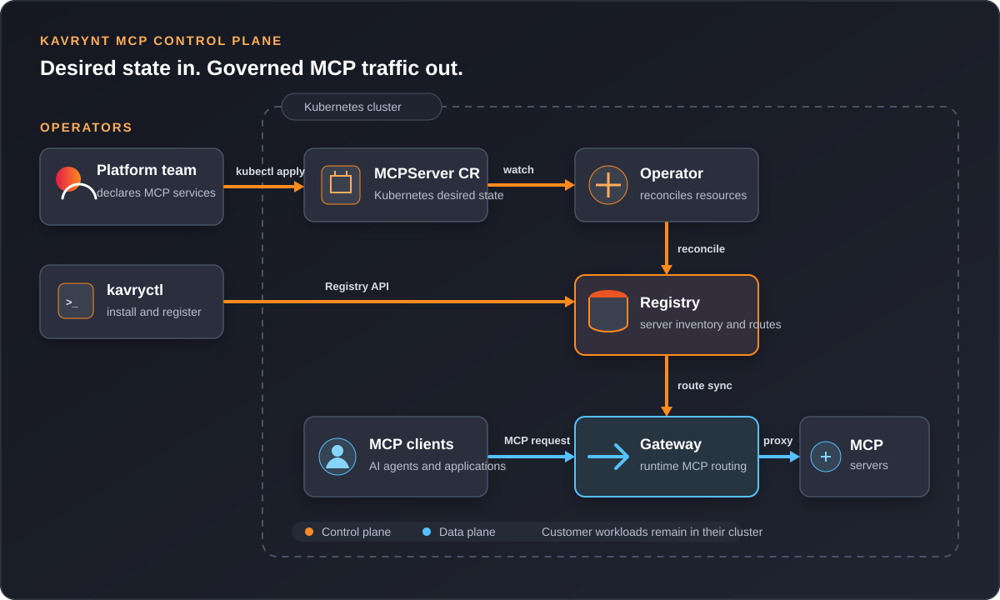

# System Architecture

Kavrynt separates developer intent, control-plane metadata, Kubernetes
reconciliation, and runtime traffic routing.

## Logical View

<figure class="architecture-diagram">
  
  <figcaption>
    Kavrynt separates control-plane reconciliation from runtime MCP traffic.
  </figcaption>
</figure>

The upper path manages desired state: platform engineers submit configuration
with `kavryctl` or Kubernetes `MCPServer` resources, the Operator reconciles
those resources, and Registry stores the resulting server inventory. The lower
path handles runtime traffic: Gateway synchronizes routes from Registry and
proxies MCP client requests to the selected MCP server workload.

## Components

| Component | Role |
| --- | --- |
| `kavryctl` | CLI used by developers and platform engineers. |
| Registry | Stores MCP server records and exposes API operations. |
| Gateway | Loads route information and proxies MCP traffic. |
| Operator | Watches Kubernetes resources and syncs desired state. |
| Helm chart | Installs the control-plane components into Kubernetes. |

## Control Plane

The control plane is responsible for metadata and desired state.

Registry is the central source of truth for server records. Operator reconciles
Kubernetes resources into Registry. `kavryctl` can also talk to Registry
directly for developer workflows.

## Data Plane

Gateway is the first data-plane component. It gives AI clients a stable route
to registered MCP servers.

In the MVP, Gateway is intentionally small. Later it can grow into policy
enforcement, auth, traffic shaping, and audit points.

## Kubernetes Boundary

Kavrynt runs inside a Kubernetes namespace:

```text
kavrynt-system
```

Expected workloads:

```text
kavrynt-registry
kavrynt-gateway
kavrynt-operator
```

## Future Commercial Control Plane

The open install path runs in a user's cluster. Kavrynt Cloud can add hosted
control services:

- Hosted registry
- Hosted control UI
- SSO and RBAC
- Audit logs
- Approval workflows
- Policy management
- Usage dashboard
- MCP capability catalog

